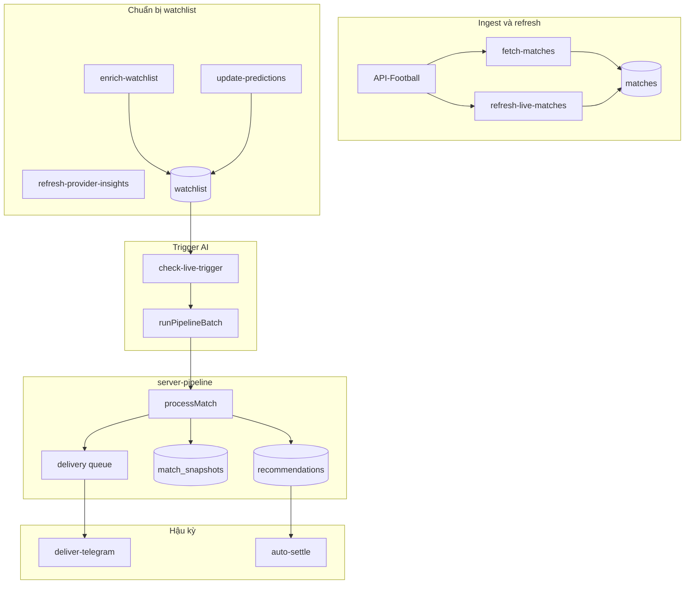
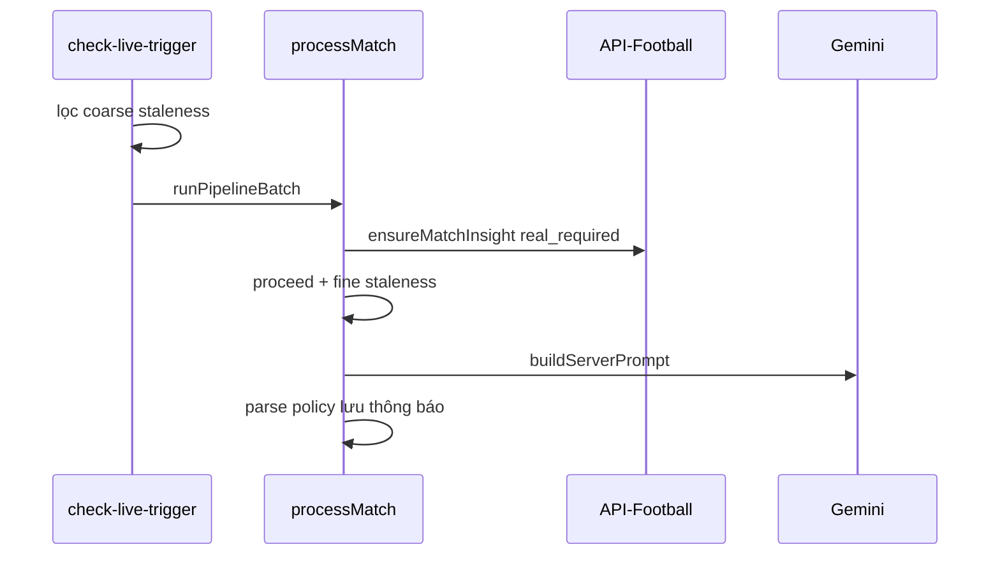
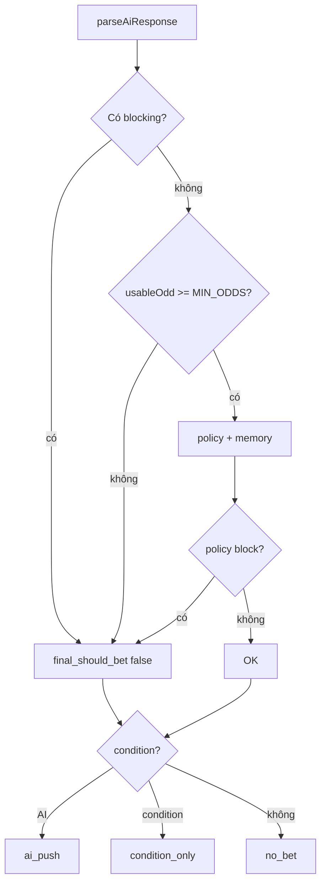

# Pipeline recommendation live score — tài liệu nghiệp vụ & kỹ thuật

**Encoding:** UTF-8 | **Cập nhật:** 2026-05  
**Mục đích:** Mô tả toàn bộ luồng, điều kiện và rule của pipeline recommendation live score (API-Football) để hỗ trợ quyết định tối ưu tiếp theo.

---

## Mục lục

1. [Tổng quan](#1-tổng-quan-và-phạm-vi) · 2. [Kiến trúc](#2-kiến-trúc-tổng-thể) · 3. [Dữ liệu live](#3-nguồn-dữ-liệu-live-score) · 4. [Jobs](#4-jobs-nền-scheduler) · 5. [Vào pipeline](#5-điều-kiện-vào-pipeline) · 6. [processMatch](#6-luồng-processmatch-từng-bước) · 7. [Gates](#7-gates-trước-llm) · 8. [Odds](#8-odds-pipeline) · 9. [Evidence](#9-evidence-mode-và-market-allowlist) · 10. [Prompt](#10-xây-dựng-prompt) · 11. [Parse](#11-parse-và-safety-layer) · 12. [Policy](#12-policy-sau-parse) · 13. [Performance memory](#13-performance-memory) · 14. [Condition](#14-condition-triggered-path) · 15. [Lưu trữ](#15-lưu-trữ-dedup-thông-báo) · 16. [Settlement](#16-settlement) · 17. [UI](#17-trigger-thủ-công-và-ui) · 18. [Cấu hình](#18-cấu-hình-và-vận-hành) · 19. [Offline](#19-ranh-giới-pipeline-offline) · 20. [Phụ lục](#20-phụ-lục)

---

## 1. Tổng quan và phạm vi

### 1.1 Mục đích

Pipeline phân tích các trận **đang live** trong watchlist vận hành:

`live score / stats / events / odds` → **Gemini** → `parseAiResponse` → **policy code** → lưu `recommendations` + thông báo.

| Khái niệm | Giá trị |
|-----------|---------|
| Nguồn live | Chỉ **API-Football** — [football-api.ts](../packages/server/src/lib/football-api.ts) |
| Engine production | [server-pipeline.ts](../packages/server/src/lib/server-pipeline.ts) |
| Trigger tự động | Job `check-live-trigger` (~5 giây) |
| Trigger thủ công | `POST /api/live-monitor/matches/:matchId/analyze` |
| Prompt | [live-analysis-prompt.ts](../packages/server/src/lib/live-analysis-prompt.ts) |

> **Lưu ý:** Live Score API (bên thứ ba cũ) đã **gỡ** (2026-04).

**Không phải production:** `src/features/live-monitor/services/pipeline.ts` (legacy). UI gọi server qua `server-monitor.service.ts`.

**Không có WebSocket:** UI poll `GET /api/matches` ~3s; AI qua job ~5s.

### 1.2 Một engine, nhiều trigger

| Trigger | Bỏ qua staleness | Bỏ qua proceed |
|---------|------------------|----------------|
| Tự động (`check-live-trigger`) | Không | Không |
| Ask AI thủ công | Có (`forceAnalyze`) | Có khi cần |
| Dashboard « Chạy Check Live » | Gọi job | Giống auto |

Thiết kế: [live-monitor-unification-design-2026-03-24.md](live-monitor-unification-design-2026-03-24.md).

---

## 2. Kiến trúc tổng thể





---

## 3. Nguồn dữ liệu live score

| Path | Mức freshness | Ghi chú |
|------|---------------|---------|
| `refresh-live-matches` | stale-while-safe | Cập nhật DB score/phút/thẻ |
| `check-live-trigger` / `processMatch` | **must-real** | Stats, events, odds cho LLM |
| `GET /api/matches` (UI) | must-real backing | Poll 3s — **không** trigger AI |
| `enrich-watchlist`, `update-predictions` | background | Prematch |

Chi tiết: [live-freshness-classification-2026-03-30.md](live-freshness-classification-2026-03-30.md).

---

## 4. Jobs nền (scheduler)

File: [scheduler.ts](../packages/server/src/jobs/scheduler.ts).

| Job | Chu kỳ mặc định | Vai trò |
|-----|-----------------|---------|
| `fetch-matches` | 60s | Ingest lịch → `matches` |
| `refresh-live-matches` | 5s | **Live score** vào DB |
| `enrich-watchlist` | 60 phút | Strategic context, điều kiện gợi ý |
| `update-predictions` | 30 phút | Prediction prematch |
| `refresh-provider-insights` | 60s | Prewarm cache provider |
| **`check-live-trigger`** | **5s** | **Trigger AI** (lock strict) |
| `deliver-telegram-notifications` | config | Gửi Telegram bất đồng bộ |
| `auto-settle` | 10 phút | Settle khi FT |
| `expire-watchlist` | — | Dọn watchlist |
| `health-watchdog` | — | Giám sát job |

---

## 5. Điều kiện vào pipeline

File: [check-live-trigger.job.ts](../packages/server/src/jobs/check-live-trigger.job.ts).

| # | Điều kiện |
|---|-----------|
| 1 | `PIPELINE_ENABLED !== 'false'` |
| 2 | `getActiveOperationalWatchlist()` có bản ghi |
| 3 | `status` ∈ `LIVE_STATUSES` (mặc định `1H,2H`) |
| 4 | `checkCoarseStalenessServer` → **không stale** |

**Coarse staleness (tại job):** chỉ `phase_changed`, `score_changed`, cooldown phút. **Không** xét bàn thắng mới, thẻ đỏ, delta odds/stats.

**Batch:** `PIPELINE_BATCH_SIZE`=3, delay 1 giây, `incrementChecksForMatches`.
---

## 6. Luồng processMatch từng bước

Hàm: `processMatch()` — [server-pipeline.ts](../packages/server/src/lib/server-pipeline.ts).

| Bước | Hành động | Nếu fail / skip |
|------|-----------|-----------------|
| 0 | Fixture, settings, prompt version | error |
| 1 | Coarse staleness | `skippedAt: staleness` |
| 2 | `ensureMatchInsight` (`real_required`) | — |
| 3 | `checkShouldProceedServer` | `skippedAt: proceed` |
| 4 | Song song: odds + ngữ cảnh prompt | — |
| 5 | `createSnapshot` + odds movements (async) | — |
| 6 | `checkStalenessServer` (fine) | `skippedAt: staleness` |
| 7 | `deriveEvidenceMode` | `low_evidence` → skip LLM |
| 8 | Gemini + parse + policy | warnings |
| 9 | `evaluateConditionTriggeredSaveDecision` | ảnh hưởng save |
| 10 | Save + notify | `saved` ≠ `notified` |

### Semantics quyết định

| Field | Ý nghĩa |
|-------|---------|
| `ai_should_push` | Ý định thô từ LLM |
| `final_should_bet` | AI bet sau safety + policy + memory |
| `should_push` | Thông báo: AI actionable hoặc condition khớp |
| `saved` | Có row `recommendations` |
| `notified` | Telegram / WebPush / delivery |

```text
finalShouldBet = parsedRaw.final_should_bet && !policyBlockedEffective
shouldPush = finalShouldBet || conditionTriggeredShouldPush
shouldSave = final_should_bet || conditionSave (trừ advisory/shadow)
```



---

## 7. Gates trước LLM

File: [server-pipeline-gates.ts](../packages/server/src/lib/server-pipeline-gates.ts).

### Proceed (`checkShouldProceedServer`)

| Rule | Mặc định |
|------|----------|
| Status | `1H`, `2H` |
| Phút min / max | 5 / 85 |
| Hiệp 2 min | 50' (45+5) |
| Stats | GOOD hoặc FAIR |
| Sớm + POOR | phút < 15 → block |
| `forceAnalyze` | bypass |

### Coarse vs fine staleness

| | Coarse | Fine |
|--|--------|------|
| Bàn thắng / thẻ đỏ | Không | Có |
| Odds delta | Không (job) | Có |
| Stats unchanged | Không | stale |

### Cooldown (cap `REANALYZE_MIN_MINUTES`=10)

| Ngữ cảnh | Phút |
|----------|------|
| 2H ≥80' | 1 |
| 2H khác | 2 |
| 1H ≥35' | 3 |
| 1H ≥20' | 4 |
| 1H còn lại | 5 |

**Tái phân tích:** `goal_scored`, `red_card`, `score_changed`, `phase_changed`, `odds_movement`, `time_elapsed`.

**Bỏ qua LLM:** `snapshot_stats_unchanged`, `no_significant_change`.

---

## 8. Odds pipeline

- `resolveMatchOdds` + `real_required`
- Cảnh báo: `ODDS_SOURCE_PREMATCH_WHILE_LIVE`
- `sanitizePromptOddsCanonical` loại market đã chết / nghi ngờ

| Tình huống | Hành động |
|------------|-----------|
| Cả hai đã ghi bàn | Xóa `btts` |
| H1 đã đóng | Xóa `ht_*` |
| Tổng bàn > line | Xóa `ou` |
| Contamination goals/corners | detect + xóa |
| Corners stale easy over | Xóa `corners_ou` |

---

## 9. Evidence mode

| Mode | Markets AI |
|------|------------|
| `full_live_data` | Tất cả |
| `stats_only` | Không |
| `odds_events_only_degraded` | O/U, AH |
| `low_evidence` | Không (trừ condition) |

`LOW_EVIDENCE_CONDITION_ONLY`: không save AI, có thể notify condition.

---

## 10. Xây dựng prompt

- 20 versions; mặc định `v10-hybrid-legacy-b`
- `buildLiveAnalysisPrompt` + strategic + prematch + memory
- Shadow không ảnh hưởng user

| Họ | Điểm chính |
|----|------------|
| v6 | Kỷ luật conf/edge/risk |
| v8 | Không fallback under |
| v10 / v10g | Hybrid + policy spec |

Debug O/U: [live-monitor-ai-ou-under-bias.md](live-monitor-ai-ou-under-bias.md).
---

## 11. Parse và safety layer

**Trước** policy — `parseAiResponse()`.

| Mã blocking | Điều kiện |
|-------------|-----------|
| `NO_SELECTION` | thiếu selection |
| `NO_BET_MARKET` | thiếu market |
| `CONFIDENCE_BELOW_MIN` | < 5 |
| `HIGH_RISK` | risk HIGH |
| `EDGE_BELOW_MIN` | edge < 3% |
| `MARKET_NOT_ALLOWED_FOR_EVIDENCE` | allowlist |
| `1X2_TOO_EARLY` | 1X2, phút < 35 |

`usableOdd` ≥ `MIN_ODDS` (1.5).

---

## 12. Policy sau parse

`applyRecommendationPolicy()` — nhóm: v10g spec, segment blocklist, 1X2, O/U, BTTS, corners, same thesis (2 rec, 10% stake), global guards.

| Env | Mặc định |
|-----|----------|
| `POLICY_REQUIRED_BREAKEVEN_MAX` | 0.5 |
| `POLICY_HIGH_RISK_BREAKEVEN_MAX` | 0.48 |
| `POLICY_LATE_GAME_BREAKEVEN_RELAXATION` | 0.05 |

### 12b. Line Ladder Patience (LLP)

Sau `parseAiResponse`, trước `applyRecommendationPolicy`: canh line / cushion / AH↔O/U / cooldown sự kiện. Mặc định bật (`LINE_PATIENCE_ENABLED` ≠ `false`). Chi tiết: [line-ladder-patience-spec.md](line-ladder-patience-spec.md).

### 12c. Thesis watch (Phase 2)

Khi LLP **defer** (`LLP_BLOCK_AH_WAIT_OU_OVER_LINE`, `LLP_BLOCK_OVER_AGGRESSIVE_LINE`, `LLP_BLOCK_CORNERS_OVER_AGGRESSIVE_LINE`), server lưu `match_thesis_watch` (pending). Chu kỳ sau, **trước Gemini**: nếu gate thỏa → `resolveThesisWatchPromoteMarket` (remap corners/goals về line live) → LLP + policy + save, **không gọi LLM**. `promoted` chỉ sau `createRecommendation` OK; shadow/advisory không ghi DB. Mặc định bật (`THESIS_WATCH_ENABLED` ≠ `false`, cần LLP). Env: `THESIS_WATCH_TTL_MINUTES` (mặc định 45).

---

## 13. Performance memory

- Memory block: WR < 40% (mẫu đủ); WR < 45% + BE cao
- Recommendation Studio đã gỡ khỏi runtime (chỉ còn bảng DB lịch sử nếu đã migrate)

---

## 14. Condition-triggered

Watchlist `custom_conditions`. Save khi: matched, không « no bet », market known, min odds/conf, policy pass. Override: cùng line, odds +0.1.

---

## 15. Lưu trữ và thông báo

- `unique_key` upsert
- `markLegacyDuplicates`
- `saved` ≠ `notified`

---

## 16. Settlement

`auto-settle` khi FT.

---

## 17. UI

Manual analyze, trigger job, dashboard — không client pipeline.

---

## 18. Cấu hình

`PIPELINE_*`, `JOB_CHECK_LIVE_MS`, `LIVE_ANALYSIS_ACTIVE_PROMPT_VERSION`, segment policy files. DB settings: `REANALYZE_MIN_MINUTES`, …

---

## 19. Pipeline offline

`data-driven:replay-batch`, `--apply-replay-policy`, gates CI. Xem [data-driven-pipeline-status.md](data-driven-pipeline-status.md).
---

## 20. Phụ lục

### Phụ lục A — Mã policy (đầy đủ)

`MARKET_UNRESOLVED`, `REQUIRED_CONDITIONS_NOT_MET`, `HIGH_RISK_MARKET_BREAKEVEN_TOO_HIGH`, `BTTS_NO_BLOCKED_GOAL_MARGIN`, `BTTS_NO_BLOCKED_MIDGAME_GOALLESS`, `BTTS_NO_INSUFFICIENT_CONDITIONS`, `MARKET_BLACKLISTED_FOR_MIDGAME_WINDOW`, `OVER_1_5_BLOCKED_LATE_MIDGAME`, `HIGH_MARGIN_MIDGAME_BLOCK`, `ONE_GOAL_MIDGAME_INSUFFICIENT_CONFIDENCE`, `LATE_MIDGAME_INSUFFICIENT_CONFIDENCE`, `POLICY_BLOCK_SEGMENT_BLOCKLIST`, `POLICY_BLOCK_1X2_DRAW`, `POLICY_BLOCK_1X2_HOME_PRE35_V8D`, `POLICY_BLOCK_1X2_HOME_PRE55_V8B`, `POLICY_BLOCK_1X2_HOME_PRE60_V8`, `POLICY_BLOCK_1X2_HOME_PRE75`, `POLICY_BLOCK_OVER_0_5_75_PLUS`, `POLICY_BLOCK_UNDER_2_5_PRE75`, `POLICY_BLOCK_GOALS_UNDER_45_59_TWO_PLUS_MARGIN_V8D`, `POLICY_BLOCK_GOALS_UNDER_30_44_0_0_OVER_1_5_V8F`, `POLICY_BLOCK_GOALS_UNDER_30_44_LEVEL_HIGH_LINE_V8F`, `POLICY_BLOCK_CORNERS_OVER_HIGH_LINE_PRE60_V8F`, `POLICY_BLOCK_CORNERS_OVER_HIGH_LINE_PRE30_V10C`, `POLICY_BLOCK_CORNERS_UNDER_EARLY_HIGH_LINE_V10C`, `POLICY_BLOCK_GOALS_UNDER_EARLY_ONE_GOAL_HIGH_LINE_V8G`, `POLICY_BLOCK_GOALS_UNDER_45_59_0_0_LOW_LINE_V8H`, `POLICY_BLOCK_GOALS_OVER_45_59_0_0_LOW_LINE_V8H`, `POLICY_BLOCK_CORNERS_OVER_45_59_ONE_GOAL_HIGH_LINE_V8H`, `POLICY_BLOCK_PROPS_HOT_ZONE_LOW_EDGE_V8J`, `POLICY_BLOCK_PROPS_HOT_ZONE_LOW_CONFIDENCE_V8J`, `POLICY_BLOCK_BTTS_NO_PRE60_V10C`, `POLICY_BLOCK_BTTS_NO_60_74`, `POLICY_BLOCK_BTTS_NO_LOW_PRICE`, `POLICY_BLOCK_BTTS_NO_HIGH_PRICE`, `POLICY_BLOCK_BTTS_NO_LOW_EDGE`, `POLICY_BLOCK_BTTS_NO_LOW_EDGE_V8J`, `POLICY_BLOCK_BTTS_NO_BOTH_TEAMS_ON_TARGET`, `POLICY_CAP_BTTS_NO_CONFIDENCE`, `POLICY_CAP_BTTS_NO_STAKE`, `POLICY_BLOCK_BTTS_YES_30_44_ONE_GOAL_LOW_DUAL_THREAT_V10G`, `POLICY_BLOCK_BTTS_YES_MIDGAME_LOW_DUAL_THREAT_V10C`, `POLICY_BLOCK_CORNERS_UNDER_45_59_ONE_GOAL_LOW_LINE_V10D`, `POLICY_BLOCK_CORNERS_OVER_45_59_ONE_GOAL_EXTREME_LINE_V10D`, `POLICY_BLOCK_GOALS_OVER_ONE_GOAL_EARLY_LONG_RUNWAY_V10D`, `POLICY_BLOCK_GOALS_OVER_ONE_GOAL_MID_LONG_RUNWAY_V10D`, `POLICY_BLOCK_GOALS_UNDER_45_59_TWO_PLUS_LOW_CUSHION_V10D`, `POLICY_BLOCK_CORNERS_UNDER_45_59_ONE_GOAL_LOW_LINE_V10E`, `POLICY_BLOCK_CORNERS_OVER_45_59_ONE_GOAL_EXTREME_LINE_V10E`, `POLICY_BLOCK_CORNERS_UNDER_45_59_LOW_LINE_CHASE_V10F`, `POLICY_BLOCK_GOALS_UNDER_45_59_TWO_PLUS_SAME_THESIS_ROLLOVER_V10F`, `POLICY_BLOCK_CORNERS_UNDER_30_44_GOALS_ON_BOARD_LOW_LINE_V10G`, `POLICY_BLOCK_CORNERS_UNDER_30_44_WEAK_PREMATCH_V10G`, `POLICY_BLOCK_GOALS_OVER_30_44_ONE_GOAL_EXTREME_RUNWAY_V10G`, `POLICY_BLOCK_HT_UNDER_TIGHT_PRE22_GLOBAL`, `POLICY_BLOCK_HT_UNDER_TIGHT_AFTER_EARLY_GOAL_GLOBAL`, `POLICY_BLOCK_HT_UNDER_TIGHT_LOW_SIGNAL_GLOBAL`, `POLICY_BLOCK_BTTS_YES_ONE_SIDE_BLANK_GLOBAL`, `POLICY_BLOCK_BTTS_YES_LOW_DUAL_THREAT_GLOBAL`, `POLICY_BLOCK_AH_HOME_CHALK_LOW_SIGNAL_GLOBAL`, `POLICY_BLOCK_AH_HOME_QUARTER_BALL_EARLY_0_0_GLOBAL`, `POLICY_BLOCK_CORNERS_UNDER_MIDGAME_GOALS_GLOBAL`, `POLICY_BLOCK_CORNERS_UNDER_LATE_ONE_GOAL_LOW_LINE_GLOBAL`, `POLICY_BLOCK_MEDIUM_RISK_THIN_EDGE_GLOBAL`, `POLICY_CAP_MEDIUM_RISK_STAKE_GLOBAL`, `POLICY_BLOCK_SAME_THESIS_COUNT_CAP`, `POLICY_BLOCK_SAME_THESIS_STAKE_CAP`, `POLICY_WARN_SEGMENT_STAKE_CAP`

### Phụ lục B — Prompt versions (20)

`v4-evidence-hardened` … `v10-hybrid-legacy-g`. Candidate: `v10-hybrid-legacy-g`.

### Phụ lục C — Skip reasons

| reason | Ý nghĩa |
|--------|---------|
| `no_significant_change` | Trong cooldown |
| `snapshot_stats_unchanged` | Fine stale |
| `goal_scored`, `red_card`, … | Tái phân tích |
| `low_evidence_without_watch_condition` | Bỏ qua trước LLM |

Audit: `PIPELINE_MATCH_SKIPPED`.

### Phụ lục D — File tham chiếu

`check-live-trigger.job.ts`, `server-pipeline.ts`, `server-pipeline-gates.ts`, `recommendation-policy.ts`, `live-analysis-prompt.ts`, `odds-resolver.ts`, `evidence-mode-market-allowlist.ts`.

### Phụ lục E — Known gaps

[pipeline-core-fix-plan-2026-03-24.md](pipeline-core-fix-plan-2026-03-24.md): save vs final decision; condition first-class; chi phí LLM; bias O/U.

| Mục tiêu | Đọc mục |
|----------|---------|
| Giảm chi phí LLM | 5, 7, 18 |
| Tăng ROI | 12, 13, 19, A |
| Bias Under | 10 + ou-under-bias |
| Condition | 14 |

---

*Tài liệu tham chiếu pipeline live. Cập nhật khi đổi code hoặc policy.*